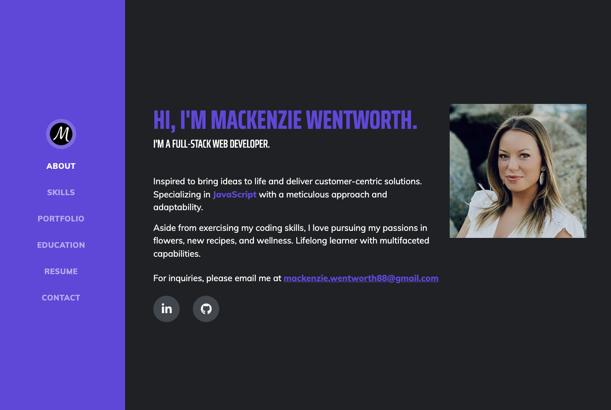

# MacKenzie Wentworth | Full-Stack JavaScript Web Developer | Professional Portfolio


Welcome to my professional portfolio! This portfolio was created using [Start Bootstrap.](https://startbootstrap.com/)

## Application Links

* GitHub Repository for Application: https://github.com/pexApred/journeyVerse

* Deployed Application via GitHub Pages: https://mackenzie-wentworth.github.io/mackenzie-wentworth-portfolio/


## Table of Contents 

- [User Story](#user-story)
- [Installation](#installation)
- [Usage](#usage)
- [Technologies Used](#technologies-used)
- [Questions](#questions)
- [License](#license)
- [Badges](#badges)


## User Story

```md
AS AN industry professional seeking a candidate in web developement, 
I WANT to view a candidate's deployed portfolio that highlights who they are, their project history, and contact information
SO THAT I can evaluate the candidate's eligibility for an available position
```


## Installation

To create my portfolio, I cloned the **Resume** template provided by **Start Bootstrap** and tailored the design with a personal touch for my final product.

To view the original repo or if you would also like to use the **Resume - Start Bootstrap** template, you can find more details and instructions on GitHub [here!](https://github.com/startbootstrap/startbootstrap-resume#preview)

## Usage

You can explore my live portfolio by [clicking here!](https://mackenzie-wentworth.github.io/mackenzie-wentworth-portfolio/)

The screenshot below demonstrates the application's front-end visuals and funcitonality.




## Technologies Used

* [VS Code](https://code.visualstudio.com/)
* [HTML5](https://blog.hubspot.com/blog/tabid/6307/bid/5847/a-marketer-s-guide-to-html5.aspx)
* [JavaScript](https://developer.mozilla.org/en-US/docs/Web/JavaScript)
* [CSS](https://developer.mozilla.org/en-US/docs/Web/CSS)
* [Favicon Generator](https://favicon.io/favicon-generator/)
* [Bootstrap Framework](https://getbootstrap.com/)
* [Start Bootstrap (Resume Template)](https://startbootstrap.com/theme/resume)
* [GitHub Pages](https://pages.github.com/)
* [Responsive Design](https://developer.mozilla.org/en-US/docs/Learn/CSS/CSS_layout/Responsive_Design)


---

## Questions?

If you have any questions, please see my contact information below to reach me for inquiries:
* **GitHub**: mackenzie-wentworth, at https://github.com/mackenzie-wentworth
* **Email**: mackenzie.wentworth88@gmail.com

---

## License
This project is covered under the [MIT License](./LICENSE). For more details, please click the license icon below under 'Badges'.

---

## Badges

[](https://opensource.org/licenses/MIT)